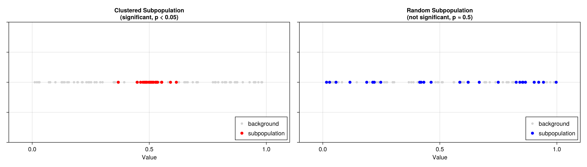
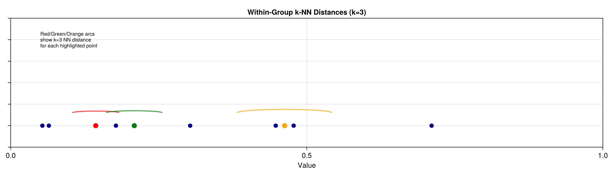
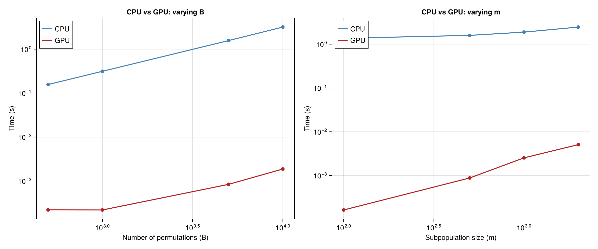
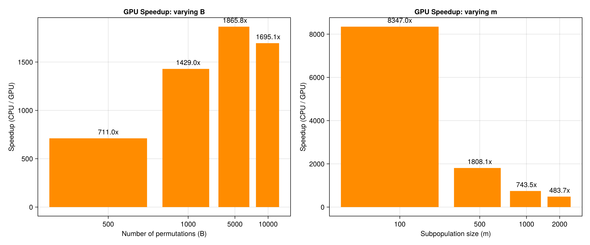

# NearestNeighborsTest.jl

[](https://kchu25.github.io/NearestNeighborsTest.jl/stable/)
[](https://kchu25.github.io/NearestNeighborsTest.jl/dev/)
[](https://github.com/kchu25/NearestNeighborsTest.jl/actions/workflows/CI.yml?query=branch%3Amain)
[](https://codecov.io/gh/kchu25/NearestNeighborsTest.jl)

A Julia package for **nearest-neighbor distance (NND) permutation tests** — testing whether a subpopulation is more tightly clustered than expected by chance, using within-group k-NN distances.

**Key feature:** optional **CUDA GPU acceleration** for dramatic speedups (10–100×) on large problems.

## Installation

```julia
using Pkg
Pkg.add(url="https://github.com/kchu25/NearestNeighborsTest.jl")
```

## Quick Start

### Single NND Permutation Test

```julia
using NearestNeighborsTest, Random

# Create some data: background of 50,000 points, 500 are clustered
rng = MersenneTwister(1)
n_bg = 50_000
background = rand(rng, n_bg)
subpop_positions = sort(randperm(rng, n_bg)[1:500])
for p in subpop_positions
    background[p] = 0.5 + 0.01 * randn(rng)  # tight cluster around 0.5
end

# CPU test
result = nnd_permutation_test_1d(subpop_positions, background; k=30, B=5_000)
println("k=$(result.k)  obs_mNND=$(result.obs_mNND)  p=$(result.p_value)")

# GPU test (requires NVIDIA GPU)
result_gpu = nnd_permutation_test_1d(subpop_positions, background; k=30, B=5_000, cuda=true)
println("GPU: k=$(result_gpu.k)  p=$(result_gpu.p_value)")
```

## What Is the NND Test?

The **nearest-neighbor distance (NND) permutation test** asks: *Is this subpopulation more tightly clustered than a random sample?*

The test works on 1-D data and computes the mean **within-group** k-NN distance. Here's why it's useful:

### Illustration: Clustered vs Random



Left: A **clustered** subpopulation (red dots) is packed together, giving small within-group k-NN distances → **small p-value** (significant).

Right: A **random** subpopulation (blue dots) is scattered throughout the background → **large p-value** (not significant).

### How k-NN Distance Works



For each point in the sorted subpopulation, we find the k nearest neighbors **within the group** and measure the distance to the k-th neighbor. The arcs above show this distance for a few highlighted points. Clustered groups have short k-NN distances; random groups have longer ones.

### Sensitivity Analysis (Multiple k Values)

```julia
ks = [5, 10, 15, 20, 25, 30]
results = nnd_sensitivity_batch_1d(subpop_positions, background; ks=ks, B=5_000)
for r in results
    println("k=$(r.k)  obs_mNND=$(round(r.obs_mNND; digits=6))  p=$(r.p_value)")
end

# GPU version
results_gpu = nnd_sensitivity_batch_1d(subpop_positions, background; ks=ks, B=5_000, cuda=true)
```

## GPU Support

Pass `cuda=true` to either function to run on GPU. The GPU implementation:

- Generates all random samples **on-device** via cuRAND (zero PCIe transfer)
- Uses shared-memory **bitonic sort** + k-NN scan within each CUDA block
- One block per permutation — massively parallel

### Benchmarks

**CPU vs GPU timing** across different numbers of permutations (B) and subpopulation sizes (m):



**GPU speedup** (how many times faster the GPU is):



## API Reference

### `nnd_permutation_test_1d`

```julia
nnd_permutation_test_1d(subpop_positions, background; k=30, B=1_000, seed=42, cuda=false)
```

Test whether points at `subpop_positions` within `background` are more tightly clustered among themselves than a random draw of the same size.

**Returns:** `NamedTuple` `(k, obs_mNND, p_value)`

### `nnd_sensitivity_batch_1d`

```julia
nnd_sensitivity_batch_1d(subpop_positions, background; ks, B=1_000, seed=42, cuda=false)
```

Batched NND test across multiple `k` values. Shares random draws across all `k` for efficiency.

**Returns:** `Vector` of `NamedTuple`s `(k, obs_mNND, p_value)`

## Method

For a subpopulation of size m drawn from a background of size N, the test statistic is the mean k-th nearest-neighbor distance **within** the group. The p-value is the fraction of B random null draws whose within-group mNND ≤ the observed value. A small p-value indicates the subpopulation is more clustered than expected by chance.

## License

MIT
